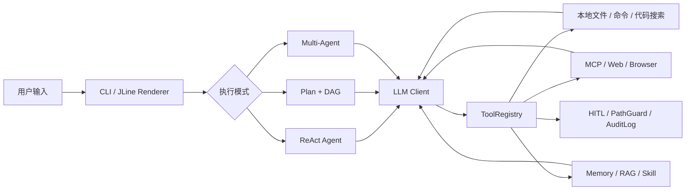

# PaiCLI 秋招主项目介绍与简历稿（工程主线）

> 核对时间：2026-07-17 
> 代码基线：`b7ee842` 
> 本文用途：先把 PaiCLI 的工程主线做成可验证、可量化、能经受面试追问的秋招主项目；算法优化作为第二阶段，暂不展开实现。

## 先说结论：这个规划是合理的

建议按下面的顺序推进：

1. **第一阶段：工程主线。** 先理解 Agent 执行链，并完成一个有明确边界、真实代码改动和测试数据的个人工程优化。
2. **第二阶段：算法亮点。** 在第一阶段稳定后，再增加一个能通过离线数据集衡量效果的大模型算法优化。
3. **最后整合。** 简历中用“Agent 工程能力 + 算法实验能力”组成两个互补亮点，而不是堆砌功能名。

这个顺序适合秋招。第一阶段负责证明 Java、系统设计、并发、容错、测试和工程落地能力；第二阶段负责证明你理解检索、上下文工程和模型效果评估。先完成第一阶段，也能防止项目范围不断膨胀，最后每个点都讲不深。

## 项目定位与包装口径

PaiCLI 的起点是教学项目，但可以作为你的**教学实践型个人主项目**。简历项目标题直接写 `PaiCLI｜Java AI Coding Agent`，不需要把“开源源码研究”放在标题里；项目介绍可以围绕你已经搭建、掌握并能够讲清楚的完整系统展开。

推荐使用以下定位：

> 基于 Java 17 完成 PaiCLI 教学项目的工程实践，在掌握 Agent 核心执行链的基础上，继续负责 Agent Runtime 可靠性改造，并补充可量化的大模型算法优化。

包装时遵循四条原则：

1. **简历归类：** 放在“个人项目”或“核心项目”中，重点写系统能力和你的后续改造。
2. **面试口径：** 如果被问到项目来源，如实说明起点是教学项目，并马上转向你理解了什么、改造了什么、指标如何。
3. **贡献证据：** 从现在开始为新增功能保留个人 commit、测试、benchmark 和设计文档，让项目逐步形成你的技术辨识度。
4. **不虚构数据：** 可以包装表达，但性能、成功率和个人工作范围必须能被代码与实验复现。

当前仓库继承了原教学项目的 Git 历史。它不妨碍 PaiCLI 成为你的简历项目，但后续包装的核心不是隐藏教学背景，而是用真实个人改造把它变成“你能主导、能解释、能继续演进”的项目。

## 项目介绍

PaiCLI 是一个使用 Java 17 开发的终端型 AI Coding Agent。它通过大模型的 tool calling 能力理解用户任务，读取和检索代码、修改文件、执行命令，并把工具结果继续回灌给模型，直到任务完成。项目目标不是做一个普通聊天客户端，而是构建具有规划、执行、记忆、工具扩展、安全审批和终端交互能力的 Agent Runtime。

### 核心执行链

### 当前真实具备的能力

- **多执行模式：** 默认 ReAct 循环、Plan-and-Execute + DAG、Planner/Worker/Reviewer 多 Agent 协作。
- **统一工具层：** 文件、Shell、代码检索、RAG、Web、Memory、Skill、Snapshot 和 MCP 动态工具统一注册；单轮最多并行执行 4 个工具，结果按原始 tool call 顺序回灌。
- **上下文工程：** 短期/长期/项目级记忆、对话压缩、动态 token 预算、Prompt 分层组装和长上下文配置。
- **代码库理解：** `glob_files`、`grep_code`、`read_file` 实时探索，以及基于 SQLite、Embedding、AST 分块和关系图谱的 RAG 辅助检索。
- **扩展与安全：** MCP stdio/Streamable HTTP、resources、Skill 按需加载、HITL 审批、路径限制、命令策略和审计日志。
- **产品化能力：** JLine inline TUI、流式输出、后台任务队列、Runtime API、Side-Git 快照回滚、图片输入和微信文本通道。
- **多模型适配：** 通过统一 `LlmClient` 接口接入 GLM、DeepSeek、Step、Kimi、FreeLLMAPI、讯飞 MaaS 和 Agnes 等 provider。

### 技术栈

| 分类 | 技术 |
|---|---|
| 核心语言与构建 | Java 17、Maven、JUnit 5 |
| LLM 与网络 | OpenAI-compatible Chat Completions、SSE、OkHttp、Jackson |
| Agent | ReAct、Plan-and-Execute、DAG、Multi-Agent、Tool Calling、MCP |
| 数据与检索 | SQLite、Embedding、余弦相似度、JavaParser AST、Jieba |
| 工程能力 | Java 并发、JLine、JGit、Jsoup、HITL、审计日志、Runtime API |

当前代码库包含 208 个主 Java 文件和 119 个测试类。这个数字只能用于说明项目规模，不能作为个人贡献数据。

## 秋招主项目的第一阶段：Agent Runtime 可靠性改造

### 为什么推荐这个方向

当前 MCP server 已支持启动、禁用、手动重启和错误隔离，但 server 异常退出后不会自动恢复；设计文档也明确记录了这个边界。以“MCP 工具服务自动恢复与执行可观测性”为个人第一项改造，有四个优势：

1. 与现有 Java 架构衔接自然，不需要推翻项目主链路。
2. 能展示状态机、线程安全、调度、重试、资源释放和故障隔离等后端能力。
3. 可以通过故障注入得到真实指标，不需要编造“效率提升”。
4. 面试追问空间足够，包括重复注册、重试风暴、幂等性、退避策略和关闭竞态。

### 第一阶段目标

把 MCP 从“出错后人工 `/mcp restart`”升级为“可配置、可观测、可安全停止的自动恢复机制”，同时保证某个 server 的故障不会阻塞 CLI 或其他工具服务。

### 建议实现范围

#### 1. 生命周期状态机

在现有 `STARTING / READY / DISABLED / ERROR` 基础上设计恢复过程，至少明确以下事件：

- 启动成功、启动失败；
- 运行时 transport 断开；
- 进入等待重试、开始重启、恢复成功；
- 达到最大重试次数；
- 用户主动 disable/close 后禁止自动拉起。

不一定必须增加很多枚举值，但状态转换、并发入口和终止条件必须能够被测试。

#### 2. 可配置退避重试

- 使用指数退避，并加入少量随机抖动，避免多个 server 同时重启；
- 设置最大重试次数和最大等待时间；
- server 连续稳定运行一段时间后重置失败计数；
- 用户手动重启优先于后台重试，并取消旧的 scheduled task；
- `disable`、项目退出和 manager `close` 必须停止后续恢复。

#### 3. 幂等注册与资源治理

- 自动恢复前移除失效 client 和动态工具；
- 恢复成功后只注册一份 `mcp__{server}__{tool}`；
- 避免残留进程、线程、future 和 notification handler；
- 多个 server 同时故障时保持相互隔离。

#### 4. 状态与可观测性

让 `/mcp` 或日志至少能展示：

- 当前状态、连续失败次数；
- 最近错误；
- 下一次重试时间；
- 最近一次恢复耗时；
- 是否因用户禁用或达到重试上限而停止恢复。

#### 5. 可重复的故障注入测试

通过可控的 fake transport/server、Clock 和 Scheduler 覆盖以下场景：

| 场景 | 验证目标 |
|---|---|
| 首次启动成功 | 正常路径无行为回退 |
| 启动失败后恢复 | 按退避策略重试并最终注册工具 |
| 运行中进程异常退出 | 能检测断连、注销旧工具并自动恢复 |
| 连续失败 | 达到上限后停止，不能无限重试 |
| 用户主动禁用 | 已排队重试被取消，server 不再拉起 |
| 多 server 并发故障 | 单点失败不阻塞其他 server |
| 恢复与手动重启竞态 | 不重复启动、不重复注册工具 |
| manager 关闭 | 不遗留进程、线程和定时任务 |

### 必须采集的指标

不要预先在简历里填写提升比例。实现完成后运行固定故障集，再记录：

| 指标 | 当前基线 | 改造后 | 说明 |
|---|---:|---:|---|
| 异常退出后的自动恢复成功率 | 0% | `[实测]` | 当前仅支持手动重启 |
| 平均恢复时间 MTTR | 不适用 | `[实测] ms` | 从断连到工具重新可用 |
| 达到上限后的额外重试数 | 不适用 | `0` | 验证熔断/停止条件 |
| 重复工具注册数 | `0` | `0` | 验证幂等性 |
| 关闭后的残留线程/进程数 | `[实测]` | `0` | 验证资源释放 |
| 正常启动耗时 P95 | `[实测] ms` | `[实测] ms` | 防止可靠性改造拖慢正常路径 |

建议把测试命令、环境、重复次数、原始结果和汇总数据写进单独的 benchmark 文档。简历只引用最终可复现的数据。

## 简历写法

### 现阶段可以使用的版本

> 适用于第一项个人工程改造尚未完成的阶段。只有在你能讲清楚对应源码后才使用。

**PaiCLI｜Java AI Coding Agent CLI** 
**技术栈：** Java 17、Maven、ReAct、Tool Calling、MCP、SQLite、JLine、OkHttp

- 基于 Java 17 完成终端型 AI Coding Agent 的工程实践，支持 ReAct、Plan-and-Execute 与 Multi-Agent 三条执行链，并接入 Memory、MCP 和本地代码工具。
- 搭建统一工具注册和并行执行机制：单轮最多并发 4 个工具，并通过超时、取消及有序结果回灌保持对话协议稳定。
- 针对 MCP server 异常退出后依赖人工重启的问题，设计自动恢复、退避重试、幂等注册和故障注入测试方案，作为后续个人工程改造主线。

这版只能证明你在读代码和做方案，不足以支撑“主项目”。第一阶段代码落地后，应换成下面的目标版本。

### 第一阶段完成后的目标版本

> 方括号内容必须替换成真实数据；没有实现的内容不能提前写进正式简历。

**PaiCLI｜面向代码任务的 Java Agent CLI** 
**技术栈：** Java 17、Maven、ReAct、DAG、Multi-Agent、MCP、SQLite、JLine、OkHttp、JUnit 5

- 基于 Java 17 实现 PaiCLI，围绕 ReAct、Plan-and-Execute 和 Multi-Agent 构建可调用本地代码工具、MCP 服务与长期记忆的终端型 AI Coding Agent。
- 负责 MCP 工具服务可靠性改造，设计 `[实际状态]` 生命周期与指数退避恢复机制，处理 transport 断连、重复注册、手动重启竞态和进程退出资源释放，将故障集自动恢复成功率从 `0%` 提升至 `[X%]`，平均恢复时间控制在 `[Y ms]`。
- 建立可重复的故障注入与回归测试，覆盖启动失败、运行时崩溃、连续失败、主动禁用和多服务并发故障等 `[N]` 类场景，并通过 Clock/Scheduler/Transport 抽象保证测试确定性。
- 完善 `/mcp` 状态和恢复日志，输出失败次数、下次重试时间、最近错误及恢复耗时，使工具服务故障能够被定位、验证和审计。

### 一页简历空间不足时的三条版

**PaiCLI｜Java AI Coding Agent** — Java 17 / ReAct / MCP / SQLite / JLine

- 基于 Java 17 实现终端型 AI Coding Agent，打通 ReAct/Plan/Multi-Agent、统一工具调用、记忆与 MCP 扩展链路。
- 设计 MCP server 自动恢复与指数退避机制，解决异常断连、重复注册和重启竞态问题，故障集恢复成功率达到 `[X%]`、MTTR 为 `[Y ms]`。
- 构建 `[N]` 类故障注入和确定性并发测试，覆盖多服务隔离、重试上限、主动禁用与资源释放，保证关闭后无残留线程和进程。

## 面试介绍模板

### 30 秒版本

> PaiCLI 是我基于教学项目完成并持续改造的 Java 终端型 AI Coding Agent，支持 ReAct、任务规划和多 Agent 三种执行方式，并通过统一工具层接入代码搜索、命令执行、Memory 和 MCP。我的第一项重点改造是 MCP 工具服务可靠性：server 崩溃后能够自动检测、注销失效工具并按指数退避恢复，同时处理重复注册、用户主动禁用和关闭竞态。我还用故障注入验证恢复成功率、MTTR 和资源释放，后续会在同一项目上加入可量化的检索算法优化。

### 面试官最可能追问的问题

1. 为什么不直接无限重试？最大重试次数和退避参数如何确定？
2. transport 断开、启动失败和工具调用失败是否应该使用同一种恢复策略？
3. 自动恢复与用户执行 `/mcp restart` 同时发生时，如何保证只启动一个 client？
4. 工具重新注册如何保证幂等？旧 tool call 正在执行时怎么处理？
5. 为什么要注入 Clock/Scheduler，而不是在测试里直接 `sleep`？
6. 如何证明没有线程、进程或 future 泄漏？
7. 为什么选择 Java 实现 Agent，而不是 Python？
8. ReAct、Plan-and-Execute 和 Multi-Agent 分别适合什么任务，它们如何复用工具执行层？
9. token 预算、对话压缩和长期记忆分别解决什么问题？
10. 教学项目提供了什么基础？你个人重点修改了哪些文件和模块？

最后一个问题必须能结合 Git 历史、设计文档和实验结果回答。面试官通常不排斥教学项目，但会非常关注你是否真正理解代码，以及是否做出了独立改造。

## 第一阶段完成标准

满足以下条件后，工程主线才算达到“秋招主项目”水平：

- 有独立、清晰的个人 feature commit，而不是只修改 README；
- 自动恢复主链路和终止条件已经实现；
- 至少覆盖上述核心故障场景，测试可以稳定重复运行；
- 有一份包含实验环境、故障模型和原始数据的 benchmark 报告；
- 能画出执行链和状态机，并解释三个以上工程取舍；
- 能明确区分教学基线与自己的重点改造，并把面试话题引向个人设计；
- GitHub README 有运行方式、演示截图或短视频，以及个人改造说明；
- 正式简历中的每个数字都能在仓库中找到证据。

## 第二阶段算法方向（暂存，不在当前阶段展开）

第一阶段完成后，优先考虑 **代码检索的混合召回与重排序优化**：在现有向量检索基础上融合关键词/符号检索、查询改写和轻量 reranker，并使用 Recall@K、MRR、nDCG、延迟和上下文 token 开销进行评估。

保留这个方向的原因是它与 PaiCLI 已有 RAG、代码搜索 golden set 和上下文预算天然衔接，既能体现大模型算法能力，也容易得到可信、可复现的提升数据。具体做哪种召回和 rerank，等第一阶段工程主线稳定后再根据时间、目标岗位和可用算力决定。

## 接下来只做第一阶段

建议下一步从一份独立设计文档开始，先确定：

1. MCP 故障事件从哪里被检测；
2. 状态转换和并发约束；
3. 重试配置与默认值；
4. 如何注入 fake transport、Clock 和 Scheduler；
5. 第一批失败测试的名称和预期行为。

设计确认后再写代码。完成实现、测试和 benchmark 后，回到本文把目标简历稿中的 `[X] / [Y] / [N]` 替换为实测结果，再进入第二阶段算法优化。
